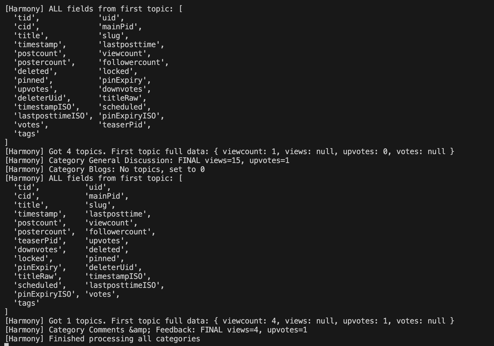

## feature: view and vote total count

The Category Statistics feature displays total view counts and upvote counts for each category on your NodeBB forum's categories page. This helps users quickly understand which categories are most active and engaging.

## What You'll See

When you visit the categories page, each category now displays four key metrics:

## How to Use

1. Navigate to your forum's categories page (usually at `/categories`)
2. Look for the statistics grid displayed for each category
3. The metrics appear below the category name and description

## automated tests

For automated test, the library.js file is configured so that when you run ./nodebb log and open catogories, this gets automatically printed.

## feature: downvote visibility

The **Downvote Visibility** feature allows users to see the list of users who have upvoted or downvoted their posts. This promotes transparency and helps users understand who supports or disagrees with their content.

## What You'll See

When viewing one of your posts, you can now see lists of users who:

* Upvoted your post
* Downvoted your post

These appear below the post’s vote icons, depending on the forum’s configuration settings.

## How to Use

1. Go to your forum and open any post you’ve made.
2. Click the vote icons under your post to view the list of upvoters and downvoters.
3. (For admins) Navigate to **Admin Panel → Settings → Reputation → Downvote Visibility** to adjust who can view this information.

   * Options include **Disabled**, **Privileged Users Only**, and **Logged-in Users**.
   * The default has been updated to **Logged-in Users**.

## Automated Tests

There were **no new automated tests** added for this feature because downvote visibility is an existing built-in NodeBB functionality.
NodeBB’s core test suite already includes tests verifying the `postsAPI.getVoters()` endpoint, which ensures both upvoters and downvoters are returned correctly. These existing tests are sufficient to confirm that enabling visibility through configuration behaves as intended.

